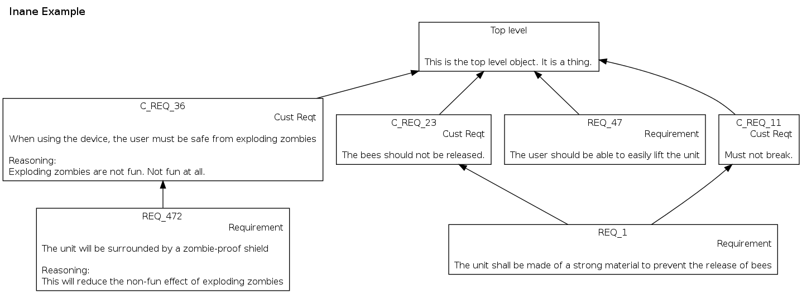

DependencyGraph
===============
A tool to convert data into dependency graphs
--------------------------------------------------
DependencyGraph converts ``csv`` files into dependency graphs using ``pygraphviz``.

CSV file structure
------------------
The ``csv`` should be saved with the columns separated by commas, and multiline strings surrounded by quotation marks. Different ``csv`` column orders can be used by using the ``-c`` flag with a four-character string composed of i, t, l and y (The default being ``itly``)

* i = Node ID - the name which will be shown at the top of the node
* t = Node text - The text which will appear below the object ID
* l = Node links - The node IDs of the nodes this node will be linked to. Multiple links can be separated with a newline character (although this character can be changed by editing line 23 of open_csv.py to change LINK_SPLIT_CHAR to whatever is desired
* y = Node type - the type of entry this node is.

The top line of the ``csv`` is ignored, so it can be used for titles

Usage
-----
The program's help message (Obtained with ``./dependency_graph.py -h``):
```
usage: dependency_graph.py [-h] [-c COLS] [-t TITLE] [-d] [-o NAME]
                           [-f {png,jpg,pdf,eps,svg}] [-e TYPE] [-x] [-v]
                           file

Convert csv files into dependency graphs

positional arguments:
  file                  location of the csv file to be converted

optional arguments:
  -h, --help            show this help message and exit
  -c COLS, --column-order COLS
                        Specify csv's column order.
                          Default order: itly
                            i: Node ID
                            t: Node text
                            l: Node links
                            y: Node type
  -t TITLE, --title TITLE
                        give the graph a custom title
  -d, --show-descriptions
                        show node descriptions (default false)
  -o NAME, --output NAME
                        specify output filename. Do not include extension
  -f {png,jpg,pdf,eps,svg}, --format {png,jpg,pdf,eps,svg}
                        choose output filetype(s)
  -e TYPE, --exclude TYPE
                        add node types to exclude
  -x, --cut             remove unlinked nodes
  -v, --verbose         print verbose messages
```

The ``-v`` tag is currently not implemented but is coming soon

If, in the ``csv`` given to the program, there are nodes which depend on nodes outside the dataset, the program will generate these nodes with the type "Unknown". These can be ignored by simply using the flag ``-e Unknown``

Dependencies
------------
* Python 2.7
* [PyGraphviz](http://pygraphviz.github.io/index.html)

Example
-------
The contents of dependencygraph/test.csv are as follows:
```
Object ID,Object Text,Link To,Type
Top level,This is the top level object. It is a thing.,,
C_REQ_11,Must not break.,Top level,Cust Reqt
C_REQ_23,The bees should not be released.,Top level,Cust Reqt
C_REQ_36,"When using the device, the user must be safe from exploding zombies

Reasoning:
Exploding zombies are not fun. Not fun at all.",Top level,Cust Reqt
REQ_1,The unit shall be made of a strong material to prevent the release of bees,"C_REQ_11
C_REQ_23",Requirement
REQ_472,"The unit will be surrounded by a zombie-proof shield

Reasoning:
This will reduce the non-fun effect of exploding zombies",C_REQ_36,Requirement
DD_43,The unit shall be made from a lightweight but strong magnesium alloy,"REQ_1
REQ_47",Detailed Design
REQ_47,The user should be able to easily lift the unit,Top level,Requirement
UNLINKED_REQ,This requirement should most definitely not be linked,,Requirement
```

Running the command ``./dependency_graph.py test.csv -t "Inane Example" -x -e "Detailed Design" -d`` yields the following image:

